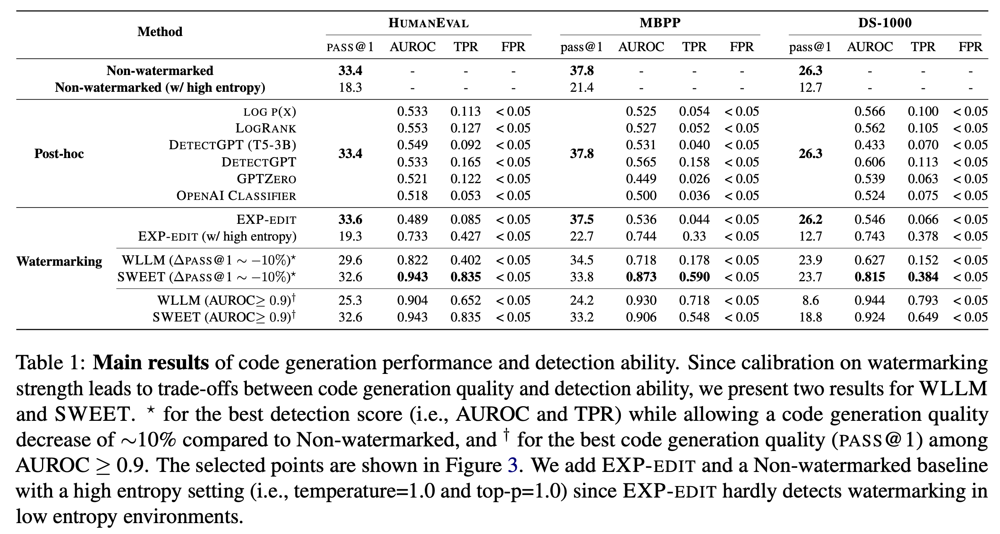
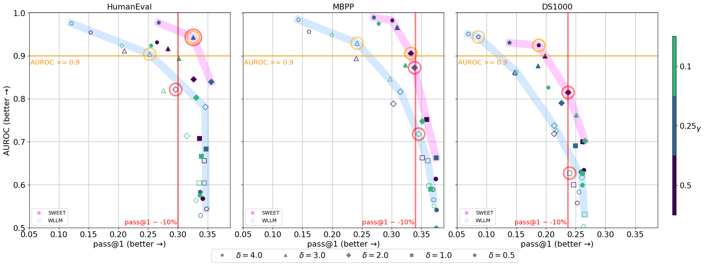

# sweet-watermark

\*\***updated (3/4/2024)**\*\* Our paper and repo are updated: DS-1000 benchmark is included, a new baseline (EXP-edit) is included for reproducing the main results. Experiments of using surrogate model, variable renaming, and detectability@T will be added.

## Introduction
Official repository of the paper:

"[Who Wrote this Code? Watermarking for Code Generation](https://arxiv.org/abs/2305.15060)" by [Taehyun Lee*](https://vision.snu.ac.kr/people/taehyunlee.html), [Seokhee Hong*](https://hongcheki.github.io/), [Jaewoo Ahn](https://ahnjaewoo.github.io/), [Ilgee Hong](https://ilgeehong.github.io/), [Hwaran Lee](https://hwaranlee.github.io/), [Sangdoo Yun](https://sangdooyun.github.io/), [Jamin Shin'](https://www.jayshin.xyz/), [Gunhee Kim'](https://vision.snu.ac.kr/gunhee/)

<p align="center">
     
</p>
<p align="center">
     
</p>

## Reproducing the Main Experiments

### 1. Generating watermarked machine-generated code, calculating pass@k and detecting watermarks
We conducted our (main) experiments by separating them into generation and detection phases. However, anyone wanting to run both phases with a single command removes the `--generation_only` argument.

For EXP-edit with a high entropy setting, please set `top_p=1.0` and `temperature=1.0`.

### generation phase
```
bash scripts/main/run_{MODEL}_generation.sh
```

### detection phase
```
bash scripts/main/run_{MODEL}_detection.sh
```

### 2. Detecting watermarks in human-written code
```
bash scripts/main/run_{MODEL}_detection_human.sh
```

### 3. Calculating Metrics (AUROC, TPR)
With both metric output files from machine-generated and human-written codes, we calculate metrics including AUROC and TPR and update the results to `OUTPUT_DIRECTORY`.

```
python calculate_auroc_tpr.py \
    --task {humaneval,mbpp} \
    --human_fname OUTPUT_DIRECTORY_HUMAN \
    --machine_fname OUTPUT_DIRECTORY
```

## Acknowledgements
This repository is based on the codes of [bigcode-evaluation-harness](https://github.com/bigcode-project/bigcode-evaluation-harness) in [BigCode Project](https://github.com/bigcode-project).

## Contact
If you have any questions about our codes, feel free to ask us: Taehyun Lee (taehyun.lee@vision.snu.ac.kr) or Seokhee Hong (seokhee.hong@vision.snu.ac.kr)
